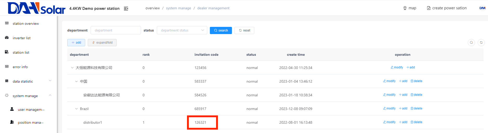

# Dealer management

## 1.Click on the name of any power station on the home page.

## 2.Click "system manage" in the left menu.

## 3.Click "dealer management" below.

## 4.Click “+add” on the top left corner. 

## 5.Select “Brazil” in the superior department. (For example) 

## 6.Fill in the other information.

## 7.Click “confirm”. (A new dealer level has been successfully created.)

## 8.Click "user management" in the left menu.(Assign an account to your dealer)

## 9.Click the dealer you just created.

## 10.Click “+add”.

## 11.Fill in the information. ”Department” should choose the dealer you just created.

## 12.Click “confirm”.

## 13.Click the name of the dealer you just created.

## 14.You can see the dealer's account information.

## 15.Give your dealer the username and password you just created in the step11. Let them use these information to log in.

(Passwords can be changed by dealers themselves .)

## 16.Log in to the account you just created.

## 17.All you can see is this dealer's information.

**The following steps are for your subordinate dealers:**

**(The purpose is to bind dealers and end users)**

## 1.Click on the name of any power station on the home page.

## 2.Click "system manage" in the left menu.

## 3.Click "dealer management" below.

## 4.Here is the invitation code.You need to tell this code to your customer.

## 5.For end users who have not yet registered for an account, let them fill in the invitation code when registering.

## 6.For end users who have already registered an account, let them modify the invitation code in the account information.

